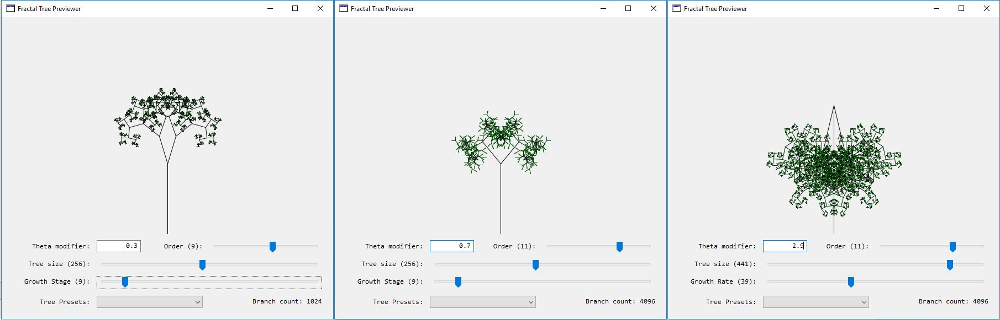

# Fractal Tree previewer

A fun tool to design & preview fractal trees.

## Setup

Just download [Xojo](https://www.xojo.com/) and try it out.

You can tweak the **theta**, **order**, **size** and **growth** of the fractal tree.

## Theory

The tree is represented via a tree structure:

- One branch
- Two child branches

TO DO: explain how it works

## Author

Joshua Woods - [Github](https://github.com/jpw1991/)
